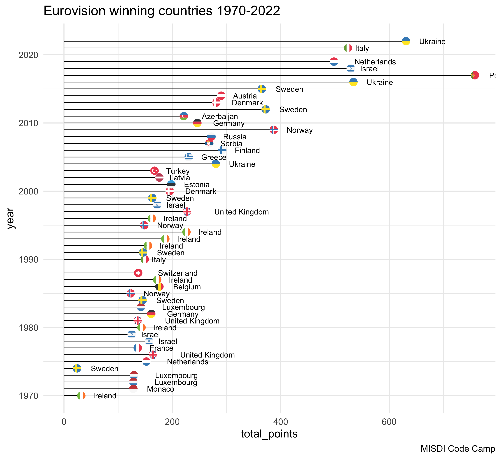
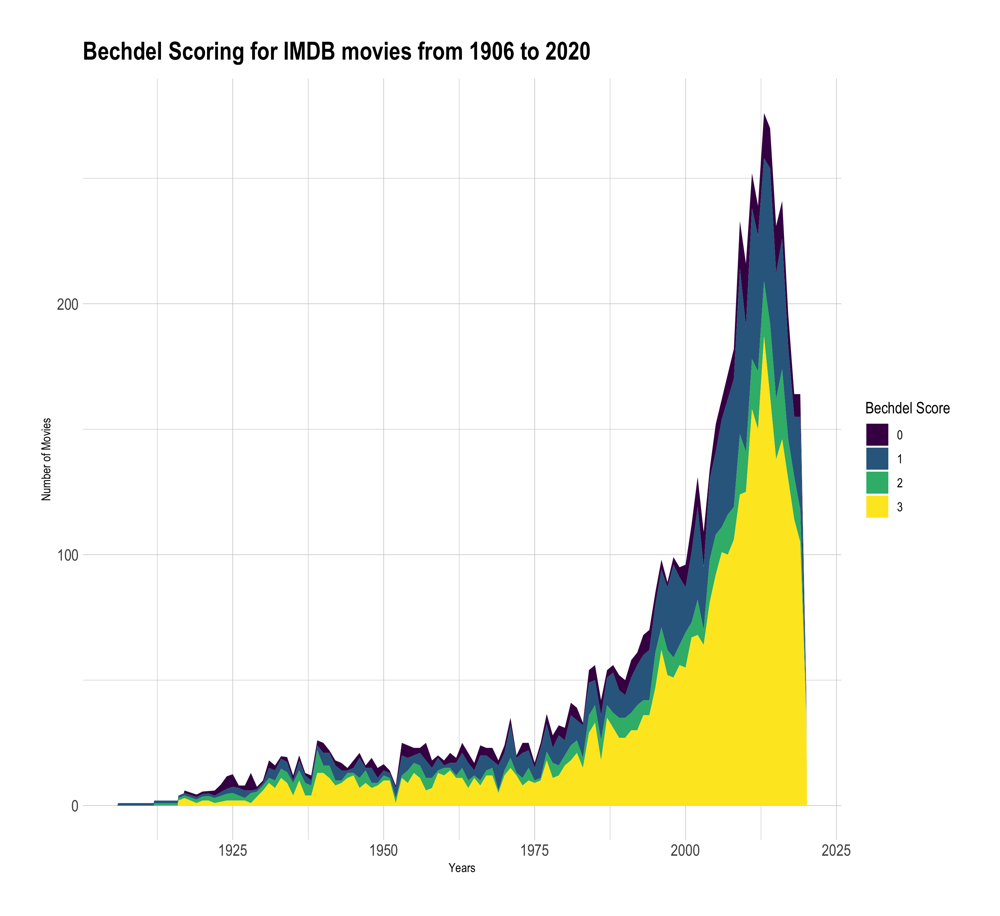
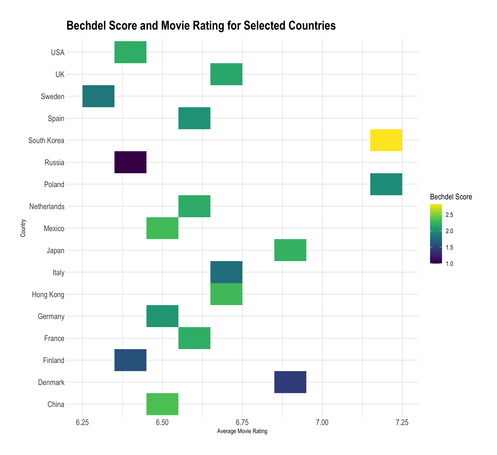

# misdi-r-datavis
First attempts to use R for data visualization during MISDI code camp 2023
## Eurovision plot
A plot to show the winners of Eurovision from the years 1970 to 2022.

## Final Project
### Stacked Area Chart
A plot to show how Bechdel Scoring for IMDB movies developed over time from 1906 until 2020

### Twist on Heatmap
Bechdel Score and Movie Rating for Selected Countries from 1960s

